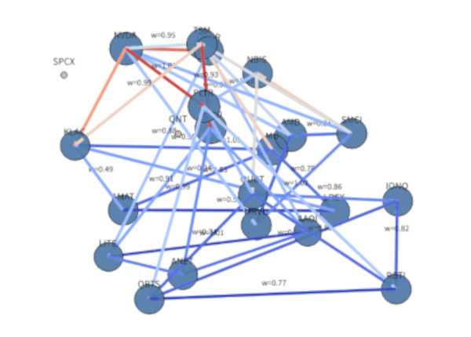

# Dynamic Market Geometry — Ricci Finance HMM

Dynamic Financial Network Geometry using:

- Ollivier Ricci Curvature
- Hidden Markov Models (HMM)
- Rolling Correlation Networks
- Financial Distance Geometry
- Plotly Animated Graphs
- Streamlit Interactive Dashboard

---

# Overview

This project visualizes the stock market as a **dynamic geometric network**.

Instead of analyzing only prices, the application studies:

- structural market stress
- sector synchronization
- fragmentation
- capital rotation
- hidden market regimes

using:

- Graph Ricci Curvature
- Dynamic financial graphs
- Hidden Markov Models (HMM)

---

# Main Concepts

## the Final (v11)

The final project is makered as [v11](https://github.com/cchuang2009/Ricci-Finance-HMM/tree/main/v11/), here the short introduction (https://github.com/cchuang2009/Ricci-Finance-HMM/tree/main/v11/output/ricci_finance_intro.mp4):


## Financial Distance

The graph uses:

$$d_{ij} = \sqrt{2(1−\rho_{ij})}$$

where:

- ρ = rolling correlation
- d = financial distance

Interpretation:

| Correlation | Distance | Meaning |
|---|---|---|
| +1 | 0 | highly synchronized |
| 0 | 1.41 | unrelated |
| −1 | 2 | opposite |

---

## Ollivier Ricci Curvature

Ricci curvature measures local network geometry.

### Positive Ricci

Blue edges.

Meaning:

- stable market structure
- coherent sector movement
- institutional accumulation
- strong synchronization

---

### Negative Ricci

Red edges.

Meaning:

- structural tension
- unstable relationships
- regime transitions
- capital migration
- speculative divergence

Large negative Ricci often appears before:

- volatility spikes
- fragmentation
- market stress

---

## Hidden Markov Model (HMM)

The HMM detects hidden market regimes using:

- average Ricci curvature
- Ricci volatility
- graph density
- market volatility
- largest connected component

Typical regimes:

| Regime | Interpretation |
|---|---|
| 0 | calm / coherent |
| 1 | fragmented / stressed |
| 2 | transition / rotation |

---

# Features

- Rolling financial correlation networks
- Dynamic Ricci curvature computation
- Animated Plotly network
- HMM market regime detection
- Edge coloring by Ricci curvature
- Node clustering
- New IPO support (example: QNT)
- Interactive controls
- Play / Pause animation

---

# Repository Structure

```text
dynamic-market-geometry/
│
├── app_v7_hmm_regime.py
├── requirements.txt
├── README.md
├── .streamlit/
│   └── config.toml
│
├── screenshots/
│   ├── network.png
│   ├── regime.png
│   └── animation.png
│
└── data/
```

---

# Installation

## Local Linux / macOS

```bash
git clone https://github.com/YOURNAME/dynamic-market-geometry.git

cd dynamic-market-geometry

pip install -r requirements.txt

streamlit run app_v7_hmm_regime.py
```

---

## Windows

```powershell
git clone https://github.com/YOURNAME/dynamic-market-geometry.git

cd dynamic-market-geometry

pip install -r requirements.txt

streamlit run app_v7_hmm_regime.py
```

---

# requirements.txt

Create:

```text
streamlit
yfinance
pandas
numpy
networkx
plotly
matplotlib
scikit-learn
hmmlearn
GraphRicciCurvature
POT
```

Optional:

```text
moviepy
kaleido
```

---

# Streamlit Cloud Deployment

## Step 1 — Create GitHub Repository

Go to:

https://github.com/new

Example repository name:

```text
dynamic-market-geometry
```

Set:

- Public
- Add README

Create repository.

---

## Step 2 — Upload Files

Upload:

- app_v7_hmm_regime.py
- requirements.txt
- README.md

Commit changes.

---

## Step 3 — Streamlit Cloud

Go to:

https://share.streamlit.io

Login using GitHub.

Select:

| Field | Value |
|---|---|
| Repository | dynamic-market-geometry |
| Branch | main |
| Main file | app_v7_hmm_regime.py |

Press:

```text
Deploy
```

---

# Streamlit Configuration

Create:

```text
.streamlit/config.toml
```

Content:

```toml
[theme]
base="light"

[server]
headless=true
```

---

# Controls

## Sidebar Controls

| Control | Meaning |
|---|---|
| Tickers | stocks to analyze |
| Window Length | rolling correlation window |
| Correlation Threshold | minimum edge creation threshold |
| Node Label Size | ticker font size |
| Animation Speed | playback speed |
| HMM States | number of hidden regimes |

---

# Interpretation Guide

## Edge Weight

Small edge weight:

- strong synchronization
- similar behavior

Large edge weight:

- independent behavior
- diversification

---

## Average Ricci

High positive:

- coherent bull market
- broad participation

Near zero:

- transition phase
- sector rotation

Strong negative:

- stress accumulation
- fragmentation
- instability

---

## Largest Connected Component

Large:

- systemic synchronization
- contagion risk

Small:

- fragmented market
- isolated themes

---

## New IPO Nodes

New IPOs appear gradually when sufficient data exists.

Example:

```text
QNT
```

Initially isolated:

- not yet integrated

Later connected:

- thematic discovery
- capital synchronization

---

# Example Themes

| Theme | Example Tickers |
|---|---|
| AI Semiconductors | NVDA, AVGO, MRVL |
| Quantum Computing | QNT, QBTS, RGTI |
| Optical Networking | AAOI, LITE, COHR |
| AI Infrastructure | ANET, SMCI |

---

# Example Workflow

1. Select tickers
2. Choose rolling window
3. Press Play
4. Observe:
   - Ricci color changes
   - cluster evolution
   - HMM regime changes
   - fragmentation
   - synchronization

---

# Research Applications

This framework can be extended toward:

- Ricci flow finance
- topological finance
- graph neural networks
- systemic risk detection
- persistent homology
- temporal Ricci tensors
- hypergraph finance

---

# Practical Trading Use

Watch for:

- sudden Ricci collapse
- isolated emerging clusters
- negative bridge edges
- HMM regime transitions

These often precede:

- volatility spikes
- sector rotation
- liquidity fragmentation

---

# Screenshots

Example:

```markdown



```

---

# Artifact Suported by [Streamlit](streamlit.io)

1 [v7](https://ricci-finance.streamlit.app/), built by Python3.12
2 [v11, the Final](https://ricci-finance-hmm-v11.streamlit.app/), built by Python 3.13

# License

MIT

---

# Citation

If used in research, please cite:

```text
Dynamic Market Geometry using Ricci Curvature and Hidden Markov Models
```

---

# Author

[Chu-Ching Huang]

Developed using:

- Streamlit
- Plotly
- GraphRicciCurvature, [patch file, streamlit_app/OllivierRicci_py313_logging.patch](OllivierRicci_py313_logging.patch)
- hmmlearn
- NetworkX
- Python
