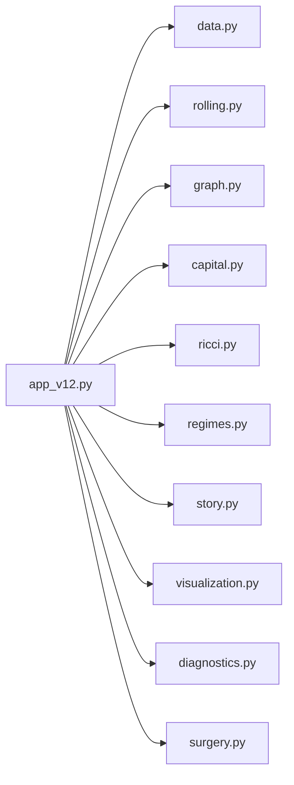
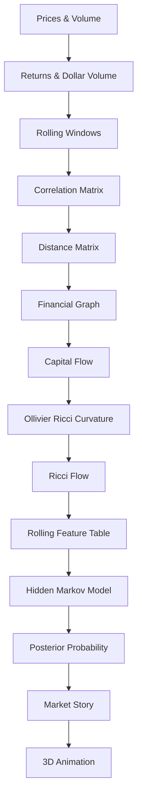
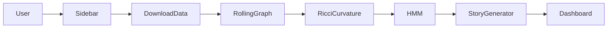

# README-03 — Software Architecture

# Software Architecture

Ricci Finance v12 is organized as a modular pipeline. Each module performs one
well-defined task and passes its results to the next stage.

---

# Overall Architecture



The Streamlit application coordinates all modules but keeps each computation
inside its own Python file.

---

# Mathematical Pipeline



---

## Mathematical Pipeline Implementation

| Stage | Module | Major Function |
|------|------|------|
| Prices & Volume | `data.py` | `download_market_data()` |
| Synthetic Data | `data.py` | `make_demo_market_data()` |
| Returns | `data.py` | `prices_to_returns()` |
| Rolling Windows | `rolling.py` | `build_rolling_frames()` |
| Single Window | `rolling.py` | `build_frame()` |
| Correlation Matrix | `graph.py` | `build_graph_from_window()` |
| Connected Components | `graph.py` | `compute_components()` |
| Capital Flow | `capital.py` | `attach_capital_attributes()` |
| Edge Capital Table | `capital.py` | `capital_flow_table()` |
| Ollivier Ricci Curvature | `ricci.py` | `compute_ricci_curvature()` |
| Ricci Flow | `ricci.py` | `run_ricci_flow()` |
| Rolling Features | `rolling.py` | `rolling_feature_table()` |
| Hidden Markov Model | `regimes.py` | `compute_hmm_regimes()` |
| Frame Story | `story.py` | `build_frame_stories()` |
| Story Table | `story.py` | `frame_story_table()` |
| Static 3D Network | `visualization.py` | `visualize_network_3d()` |
| Animated Network | `visualization.py` | `build_3d_ricci_capital_animation()` |

---

# Execution Workflow



---

## Execution Details

1. The user selects tickers and parameters in the Streamlit sidebar.

2. Historical prices and trading volume are downloaded.

3. Returns and dollar volume are computed.

4. Rolling windows are generated.

5. Each rolling window constructs a financial graph.

6. Capital-flow information is attached to every node and edge.

7. Ollivier Ricci curvature is computed.

8. Optional Ricci Flow smooths the graph geometry.

9. Every rolling window becomes one **Frame**.

10. Graph statistics are extracted from each frame.

11. Hidden Markov Model estimates the market regime.

12. Posterior probabilities are computed.

13. Story generation summarizes changes between consecutive frames.

14. Plotly generates interactive 3D visualizations.

15. Streamlit displays all diagnostics.

---

# Data Flow

```text
Prices
        │
        ▼
Returns
        │
        ▼
Rolling Windows
        │
        ▼
Financial Graph
        │
        ▼
Capital Flow
        │
        ▼
Ricci Curvature
        │
        ▼
Ricci Flow
        │
        ▼
Rolling Features
        │
        ▼
Hidden Markov Model
        │
        ▼
Posterior Probability
        │
        ▼
Story Generator
        │
        ▼
Interactive 3D Animation
```

---

# Design Philosophy

Ricci Finance v12 follows a layered architecture.

```
Presentation Layer
        │
        ▼
Streamlit Dashboard

        │
        ▼
Visualization Layer

        │
        ▼
Story Layer

        │
        ▼
Machine Learning Layer

        │
        ▼
Geometry Layer

        │
        ▼
Graph Layer

        │
        ▼
Data Layer
```

Each layer only depends on the layer immediately below it, making the framework
easy to extend, test, and maintain.

---

# Advantages of the Modular Design

- Clear separation of responsibilities.
- Easy replacement of algorithms (e.g., HMM → Transformer).
- Independent testing of each module.
- Reusable functions for notebooks and research.
- Clean integration with Streamlit and Jupyter.
- Suitable for future extensions such as Graph Neural Networks, Persistent
  Homology, Bayesian HMMs, and multi-layer financial networks.
