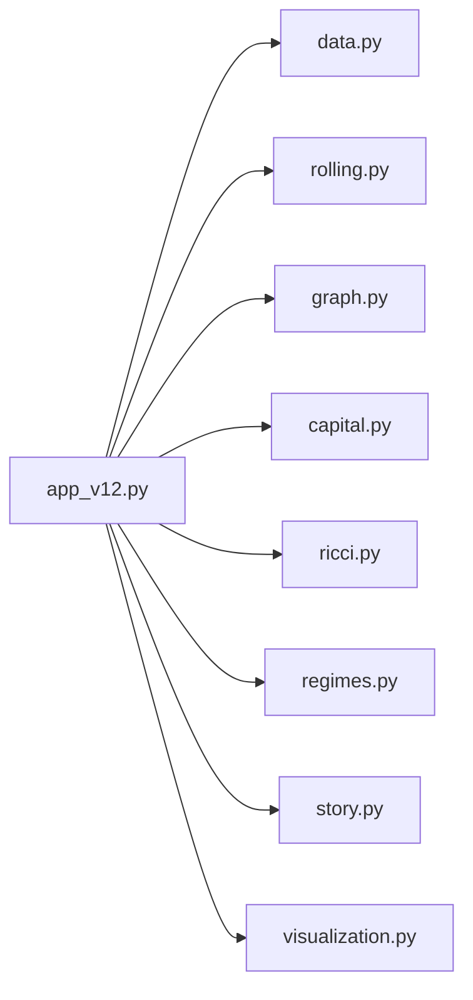
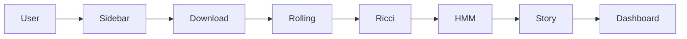

# Architecture

## Software Architecture



## Mathematical Pipeline

```mermaid
flowchart TD
A[Prices & Volume<br/>data.py<br/>download_market_data()]
-->B[Returns & Dollar Volume<br/>prices_to_returns()]
-->C[Rolling Windows<br/>build_rolling_frames()]
-->D[Correlation<br/>build_graph_from_window()]
-->E[Distance Matrix]
-->F[Financial Graph]
-->G[Capital Flow<br/>attach_capital_attributes()]
-->H[Ollivier Ricci<br/>compute_ricci_curvature()]
-->I[Ricci Flow<br/>run_ricci_flow()]
-->J[Feature Table<br/>rolling_feature_table()]
-->K[Gaussian HMM<br/>compute_hmm_regimes()]
-->L[Posterior Probability]
-->M[Story<br/>build_frame_stories()]
-->N[3D Animation<br/>build_3d_ricci_capital_animation()]
```

## Execution Workflow


