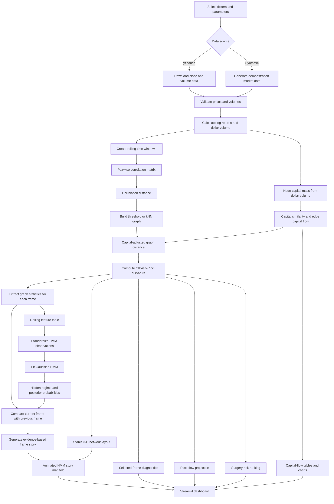

# Ricci Finance v12 — HMM Story Manifold

Ricci Finance v12 converts rolling financial-market data into a dynamic network, measures its geometry with Ollivier–Ricci curvature, estimates hidden market regimes with a Gaussian Hidden Markov Model, and presents the result as an interactive 3-D market story.

The application is designed for research and visualization. It describes changes in market structure; it does not guarantee or directly predict future prices.

## System workflow



A compact view of the mathematical pipeline is:

```text
Prices and volume
      ↓
Returns and dollar volume
      ↓
Rolling correlation network
      ↓
Capital-adjusted graph distance
      ↓
Ollivier–Ricci curvature
      ↓
Graph-level time series
      ↓
Gaussian HMM regimes and posterior probabilities
      ↓
Frame-to-frame story and 3-D animation
```

## What one rolling frame means

A frame is one rolling market window. For example, with a 60-day window and a 5-day step:

```text
Frame 1: trading days   1–60
Frame 2: trading days   6–65
Frame 3: trading days  11–70
...
```

Each frame contains:

- a correlation matrix;
- a financial-distance matrix;
- a network graph;
- node capital mass;
- edge capital flow;
- Ollivier–Ricci curvature;
- connected components or clusters;
- graph-level statistics;
- an HMM state and posterior confidence;
- a story comparing it with the previous frame.

The **Selected frame** slider chooses which one of these rolling windows is inspected in detail.

## Core mathematical definitions

### Log return

For ticker \(i\),

\[
r_i(t)=\log\frac{P_i(t)}{P_i(t-1)}.
\]

### Correlation distance

For a pair of tickers \(i,j\),

\[
d_{ij}^{\mathrm{corr}}=\sqrt{2\left(1-\rho_{ij}\right)}.
\]

Highly correlated tickers have a shorter graph distance.

### Capital-adjusted distance

v12 modifies the correlation distance using similarity in dollar-volume scale:

\[
d_{ij}^{\mathrm{eff}}
=
\frac{d_{ij}^{\mathrm{corr}}}
{1+\alpha_c s_{ij}},
\]

where:

- \(\alpha_c\) is the sidebar **Capital-distance weight**;
- \(s_{ij}\) is capital similarity between the two nodes.

This adjustment changes the geometry used by the Ricci calculation. It does not change the original return correlation.

### Edge capital flow

The implemented edge-flow proxy is proportional to:

\[
F_{ij}
=
\sqrt{M_iM_j}\max(\rho_{ij},0),
\]

where \(M_i\) and \(M_j\) are median dollar-volume masses in the current rolling window.

This is a transport proxy, not a direct measurement of money physically moving from one stock to another.

### Ollivier–Ricci curvature

Each graph edge receives a curvature value \(\kappa_{ij}\):

- negative curvature: bridge-like, stretched, or fragile relationship;
- near-zero curvature: relatively neutral local geometry;
- positive curvature: locally cohesive or redundant relationship.

The application keeps a fixed curvature color scale so different frames can be compared consistently.

### Hidden Markov Model

For each rolling frame, v12 constructs an observation vector containing features such as:

```text
average curvature
curvature dispersion
minimum curvature
negative-edge ratio
cluster count
largest-component ratio
edge count
network density
component entropy
edge stability
capital-flow intensity
capital concentration
```

The Gaussian HMM then estimates:

- the most likely hidden regime;
- the posterior probability of every hidden state;
- the confidence of the selected state.

The implementation uses:

```python
model.fit(X_scaled)
states = model.predict(X_scaled)
probabilities = model.predict_proba(X_scaled)
```

This avoids relying on `fit_predict()`, which is absent in some `hmmlearn` releases.

## HMM regime interpretation

State numbers are arbitrary. v12 orders the fitted states using graph cohesion and then assigns descriptive labels such as:

| Label | General interpretation |
|---|---|
| `stress / fragmentation` | weaker curvature, fragmented components, or fragile bridges |
| `transition / rotation` | network structure is changing between market basins |
| `coherent risk-on` | comparatively cohesive and connected market structure |

These labels are descriptive. They are not universal economic truths and may change with the ticker universe, rolling window, graph parameters, and sample period.

## Frame story generation

For frame \(t\), v12 compares the graph statistics with frame \(t-1\):

\[
\Delta X_t=X_t-X_{t-1}.
\]

The story generator checks changes in:

- average Ricci curvature;
- negative-curvature edge ratio;
- graph density;
- largest-component ratio;
- cluster count;
- capital concentration;
- edge stability.

It then reports, for example:

```text
Network curvature weakened.
Fragile bridge relationships increased.
The graph split into an additional cluster.
Edge stability fell below the structural-change threshold.
```

The narrative also identifies:

- the most negative-curvature edge;
- the largest capital-flow edge;
- the HMM regime;
- the posterior confidence of that regime.

The generated text is evidence-based but descriptive. It should not be interpreted as proof of causality or as a guaranteed trading signal.

## 3-D visual encoding

### Nodes

| Visual property | Meaning |
|---|---|
| node label | ticker |
| node color | connected component or cluster |
| node size | relative capital mass |
| node z-axis, `ricci_stress` | mean local curvature stress |
| node z-axis, `capital_mass` | logarithmic capital mass |

### Edges

| Visual property | Meaning |
|---|---|
| edge existence | graph relationship selected by threshold or kNN rule |
| edge color | Ollivier–Ricci curvature |
| edge width | dollar-volume-weighted capital-flow proxy |
| hover correlation | rolling return correlation |
| hover distance | capital-adjusted graph distance |
| hover confidence | reliability based on overlapping observations |

Curvature colors use the fixed range configured in `visualization.py`:

```text
red   → negative curvature / fragile bridge
white → curvature near zero
blue  → positive curvature / cohesive edge
```

## Dashboard tabs

### 1. HMM story animation

Shows the complete rolling 3-D manifold. Every animation frame updates:

- window-end date;
- inferred HMM regime;
- posterior confidence;
- graph-change narrative;
- fragile edge;
- dominant capital-flow edge.

### 2. Selected-frame story

Provides detailed inspection of one rolling frame:

- frame number and date;
- HMM label and confidence;
- frame-to-frame changes;
- static 3-D graph;
- complete edge table.

### 3. HMM probabilities

Displays the posterior probability of every hidden state through time. This is more informative than only displaying the most likely state.

### 4. Rolling diagnostics

Displays rolling graph observables such as curvature, density, cluster count, edge stability, and capital-flow statistics.

### 5. Capital flow

Displays:

- ranked edge-flow table;
- node capital table;
- cluster capital table;
- top transport-edge chart.

### 6. Ricci flow

Compares the observed graph with a Ricci-flow projection.

Ricci flow is a geometric regularization experiment. It is **not** a time forecast of future market prices.

### 7. Surgery risk

Ranks edges that combine:

- negative curvature;
- long effective distance;
- large capital flow;
- bridge-like topology.

The standard dashboard does not automatically remove those edges. Experimental edge cutting is available separately through `perform_financial_surgery()`.

## Project structure

```text
v12/
├── app_v12.py                 # Streamlit application
├── helper.py                  # compatibility import facade
├── README.md
├── requirements.txt
├── smoke_test.py
└── ricci_finance/
    ├── __init__.py
    ├── capital.py             # capital mass and flow proxies
    ├── config.py              # parameter dataclasses
    ├── data.py                # yfinance and synthetic data
    ├── diagnostics.py         # edge inspection tables
    ├── features.py            # market features
    ├── graph.py               # correlation graph construction
    ├── layouts.py             # stable graph layouts
    ├── models.py              # FrameData and WindowStats
    ├── plots.py               # diagnostic Plotly figures
    ├── regimes.py             # Gaussian HMM and probabilities
    ├── ricci.py               # curvature and Ricci flow
    ├── rolling.py             # rolling-frame pipeline
    ├── story.py               # frame comparison and narrative
    ├── surgery.py             # surgery-risk analysis
    └── visualization.py       # static and animated 3-D graphs
```

## Installation

Python 3.12 or 3.13 is recommended when all scientific dependencies are available for the platform.

```bash
python -m venv .venv
source .venv/bin/activate

python -m pip install --upgrade pip
pip install -r requirements.txt
```

The major dependencies are:

```text
streamlit
yfinance
pandas
numpy
networkx
plotly
matplotlib
scikit-learn
hmmlearn
GraphRicciCurvature
POT
networkit
```

## Run the application

```bash
streamlit run app_v12.py
```

Then open the local Streamlit address shown in the terminal, normally:

```text
http://localhost:8501
```

## Run the smoke test

```bash
python smoke_test.py
```

Expected output:

```text
v12 Phase 3 HMM story smoke test passed
```

## Suggested starting settings

For a first run:

```text
Data source: Synthetic
Rolling window: 60
Frame step: 5
Maximum frames: 30
Graph mode: knn+bridges
kNN neighbors: 3
Capital-distance weight: 0.35
HMM states: 3
3-D z-axis: ricci_stress
```

After confirming that the application works, switch the data source to `yfinance`.

## Parameter guidance

| Parameter | Effect |
|---|---|
| rolling window | larger values are smoother; smaller values react faster |
| frame step | smaller values create smoother animation but more computation |
| maximum frames | limits animation and HMM workload |
| graph mode | chooses threshold, kNN, or kNN with extra bridges |
| kNN neighbors | controls local network connectivity |
| capital-distance weight | controls influence of capital similarity on distance |
| HMM states | controls number of inferred structural regimes |
| 3-D z-axis | switches between geometric stress and capital scale |

## Research limitations

1. Correlation is not causation.
2. The capital-flow measure is a proxy derived from dollar volume and correlation.
3. HMM labels are sample-dependent and should be validated out of sample.
4. Ricci curvature measures local graph geometry; it is not itself a price forecast.
5. Ricci flow is a regularization experiment, not the future evolution of the market.
6. Automated stories depend on fixed thresholds in `story.py`.
7. Results may change materially with ticker selection and graph parameters.
8. Sparse or missing market data can alter graph connectivity and regime assignment.

## Recommended future development

- walk-forward HMM validation;
- state-transition probability dashboard;
- persistent cluster identities across frames;
- directed lead–lag capital-flow graph;
- probabilistic forecasts of graph-level variables;
- export of animation to HTML or MP4;
- unit and regression tests for every module;
- comparison with GARCH, VAR, DeepAR, Chronos, or Toto forecasts.

## Disclaimer

This project is for education and research. It is not investment advice, and its outputs should not be used as the sole basis for financial decisions.
